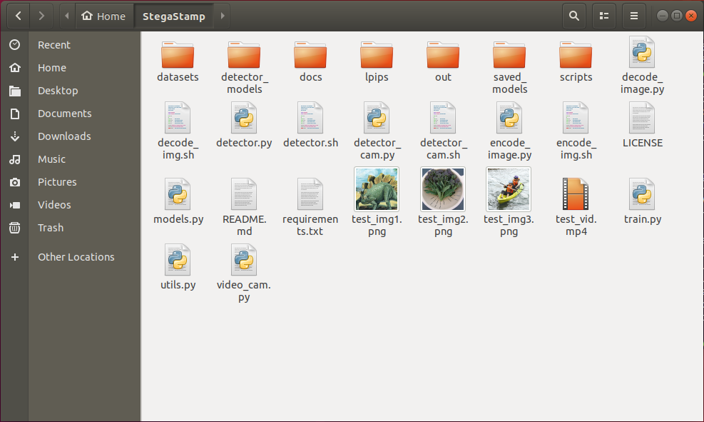

# StegaStamp-plus
> A good exploit is one that is delivered in style.  -- Saumil Shah

Improved the original repo, <i>Invisible Hyperlinks in Physical Photographs</i> @tancik, which without datasets and training parameters.

<p align="center">
  
</p>

## Features

- Improved training processing;
- Discovered training super-patrameters;
- Provided available training datasets;
- Shell scripts was organized instead of Python;

## Special Acknowledgement

The original author @[tancik](https://github.com/tancik).

## StegaStamp

> ## StegaStamp: Invisible Hyperlinks in Physical Photographs (CVPR 2020) [[Project Page]](http://www.matthewtancik.com/stegastamp)
> **[Matthew Tancik](https://www.matthewtancik.com), [Ben Mildenhall](http://people.eecs.berkeley.edu/~bmild/), [Ren Ng](https://scholar.google.com/citations?hl=en&user=6H0mhLUAAAAJ)**
*University of California, Berkeley*
> 


## Introduction
This repository is a code release for the ArXiv report found [here](https://arxiv.org/abs/1904.05343). The project explores hiding data in images while maintaining perceptual similarity. Our contribution is the ability to extract the data after the encoded image (StegaStamp) has been printed and photographed with a camera (these steps introduce image corruptions). This repository contains the code and pretrained models to replicate the results shown in the paper. Additionally, the repository contains the code necessary to train the encoder and decoder models.

<h2 class="grey-heading">Method</h2>
<h3 class="sub_heading">Deployment</h3>
<div>
	<div class="div-block-5">
	
	</div>
	<p class="paragraph-3 stega_text">Our system uses an encoder network to process the input image and hyperlink bitstring into a StegaStamp. The StegaStamp is then printed and captured by a camera. A detection network localizes and rectifies the StegaStamp before passing it to the decoder network. After the bits are recovered and error corrected, the user can follow the hyperlink.</p>
</div>

<h3 class="sub_heading">Training</h3>
<div>
<p class="paragraph-3 stega_text"> To train the encoder and decoder networks, we simulate the corruptions caused by printing, reimaging, and detecting the StegaStamp with a set of differentiable image augmentations.</p>
</div>

## Installation
- Clone repo and install submodules
```bash=
git clone --recurse-submodules https://github.com/tancik/StegaStamp.git
cd StegaStamp
```
- Install tensorflow (tested with tf 1.13)
- Python 3 required
- Download dependencies
```bash=
pip install -r requirements.txt
```

## Training
### Encoder / Decoder
- Set dataset path in train.py
```
TRAIN_PATH = DIR_OF_DATASET_IMAGES
```

- Train model
```bash=
bash scripts/base.sh EXP_NAME
```
The training is performed in `train.py`. There are a number of hyperparameters, many corresponding to the augmentation parameters. `scripts/bash.sh` provides a good starting place.

#### Pretrained network
Run the following in the base directory to download the trained network used in paper:
```bash=
wget http://people.eecs.berkeley.edu/~tancik/stegastamp/saved_models.tar.xz
tar -xJf saved_models.tar.xz
rm saved_models.tar.xz
```

### Detector
The training code for the detector model (used to segment StegaStamps) is not included in this repo. The model used in the paper was trained using the BiSeNet model released [here](https://github.com/GeorgeSeif/Semantic-Segmentation-Suite). CROP_WIDTH and CROP_HEIGHT were set to 1024, all other parameters were set to the default. The dataset was generated by randomly placing warped StegaStamps onto larger images.

The exported detector model can be downloaded with the following command:
```bash=
wget http://people.eecs.berkeley.edu/~tancik/stegastamp/detector_models.tar.xz
tar -xJf detector_models.tar.xz
rm detector_models.tar.xz
```

### Tensorboard
To visualize the training run the following command and navigate to http://localhost:6006 in your browser.
```bash=
tensorboard --logdir logs
```

## Encoding a Message
The script `encode_image.py` can be used to encode a message into an image or a directory of images. The default model expects a utf-8 encoded secret that is <= 7 characters (100 bit message -> 56 bits after ECC).

Encode a message into an image:
```bash=
python encode_image.py \
  saved_models/stegastamp_pretrained \
  --image test_im.png  \
  --save_dir out/ \
  --secret Hello
```
This will save both the StegaStamp and the residual that was applied to the original image.

Or run the bash code directly:
```bash=
bash encode_image.sh
```

## Decoding a Message
The script `decode_image.py` can be used to decode a message from a StegaStamp.

Example usage:
```bash=
python decode_image.py \
  saved_models/stegastamp_pretrained \
  --image out/test_hidden.png
```

Samely, or run the bash code directly:
```bash=
bash decode_image.sh
```

## Detecting and Decoding
The script `detector.py` can be used to detect and decode StegaStamps in an image. This is useful in cases where there are multiple StegaStamps are present or the StegaStamp does not fill the frame of the image.

To use the detector, make sure to download the detector model as described in the installation section. The recomended input video resolution is 1920x1080.

```bash=
python detector.py \
  --detector_model detector_models/stegastamp_detector \
  --decoder_model saved_models/stegastamp_pretrained \
  --video test_vid.mp4
```

<strong>Discription:</strong>
- Add the `--save_video FILENAME` flag to save out the results.

- The `--visualize_detector` flag can be used to visualize the output of the detector network. The mask corresponds to the segmentation mask, the colored polygons are fit to this segmentation mask using a set of heuristics. The detector outputs can noisy and are sensitive to size of the stegastamp. Further optimization of the detection network is not explored in this paper.

Samely, or run the bash code directly:
```bash=
bash detector.sh
```
in the terminal.

### Detecting and Decoding from Webcam
In browser 

```bash=
localhost:8080/detecdecode.html
```

## Example Encoded Images

<table>
  <tbody>
		<tr>
			<td></td>
			<td></td>
			<td></td>
		</tr>
		<tr>
			<td></td>
			<td></td>
			<td></td>
		</tr>
		<tr>		
			<td></td>
			<td></td>
			<td></td>
		</tr>
		<tr>
			<td><div id="w-node-c76dcfc62cf8-64fa863e" class="stega_example_label">Original Image</div></td>
			<td><div id="w-node-62d402cd6de4-64fa863e" class="stega_example_label">StegaStamp</div></td>
			<td><div id="w-node-3acde7b9475e-64fa863e" class="stega_example_label">Residual</div></td>
		</tr>
	</tbody>
</table>
<p class="paragraph-3 stega_text">Here are examples of images that have been converted to StegaStamps. The residual depicts the difference between the original image and the StegaStamp.</p>
	
## Results

<table>
  <tbody>
		<tr>
			<td></td>
			<td></td>
		</tr>
		<tr>
			<td><div class="captions">Oblique Angles</div></td>
			<td><div class="captions">Variable Lighting</div></td>
		</tr>
		<tr>
			<td></td>
			<td></td>
		</tr>
		<tr>
			<td><div class="captions">Occlusion</div></td>
			<td><div class="captions">Reflections</div></td>
		</tr>
	</tbody>
</table>
<p class="paragraph-3 stega_text stega_results_text">Here are examples of detection and decoding. The percentage corresponds to the number of bits correctly decoded. Each of these examples encode 100 bits. </p>

## Getting Started Yourself

The project is still a work in progress, but I want to put it out so that I get some good suggestions.

The easiest way to get started is to simply try out on Colab: 

[](https://colab.research.google.com/github/Charmve/StegaStamp/blob/master/StegaStamp_train_model.ipynb)  

The secret.len is limited 7 characters (56 bit).

## Disclaimer

Thanks to the excilent open source work from Matthew Tancik, Ben Mildenhall, et.al !

> Any interest disputes and social consequences arising from using this method have nothing to do with the open source author of this project.
